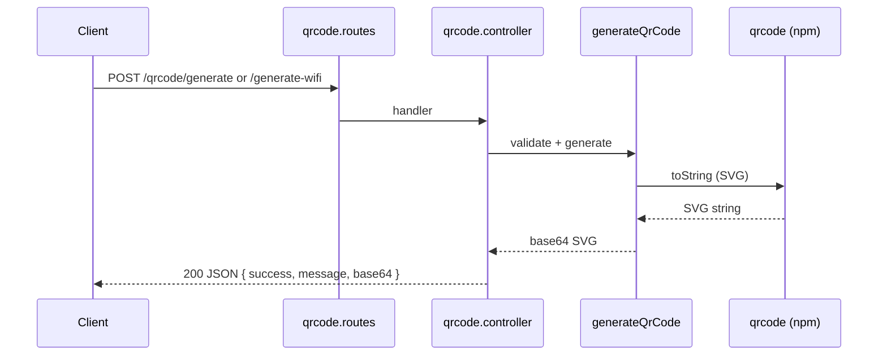

# cms-generate-qrcode — Engineering Documentation

HTTP microservice that generates QR codes as base64-encoded SVG. Supports URL QR codes and WiFi connection QR codes (added in PR #1).

## Architecture

```
src/index.ts                 # Entry point — binds HTTP server to configured port
src/app/http/
  index.ts                   # Express app: JSON body parser, /qrcode routes, error handler
  qrcode/
    qrcode.routes.ts         # Route definitions
    qrcode.controller.ts     # Request handlers
src/libs/
  config/index.ts            # App name, version, port, NODE_ENV from env
  helpers/generateQrCode.ts  # Validation, SVG generation, WiFi payload encoding
  exceptions/InvalidParameterException.ts
  middlewares/errorHandler.middleware.ts
```

Request flow:



All QR output is **SVG** rendered by the [`qrcode`](https://www.npmjs.com/package/qrcode) package, then UTF-8 encoded to base64. Clients must decode base64 and render or embed the SVG.

## Setup

### Prerequisites

- Node.js (compatible with TypeScript 6 / Express 5)
- npm

### Install and run

```bash
npm install
npm run dev      # development with hot reload (ts-node-dev)
npm run build    # compile to dist/
npm start        # run compiled output
```

### Environment variables

| Variable | Default | Description |
|----------|---------|-------------|
| `APP_PORT_HTTP` | `3050` | HTTP listen port |
| `NODE_ENV` | `development` | Runtime environment label (informational) |

Create a `.env` file in the project root (gitignored):

```env
APP_PORT_HTTP=3050
NODE_ENV=development
```

On startup the server logs: `{APP_NAME} v{APP_VERSION} berjalan di http://localhost:{port}`.

## HTTP API

Base path: `/qrcode`. All endpoints accept `Content-Type: application/json`.

### POST `/qrcode/generate`

Generates a QR code encoding a validated HTTP/HTTPS URL.

**Request body**

| Field | Type | Required | Constraints |
|-------|------|----------|-------------|
| `url` | string | yes | Non-empty; must parse as `http:` or `https:` URL |

**Success response** — `200`

```json
{
  "success": true,
  "message": "QR code berhasil dibuat",
  "base64": "<base64-encoded SVG>"
}
```

**Example**

```bash
curl -X POST http://localhost:3050/qrcode/generate \
  -H "Content-Type: application/json" \
  -d '{"url": "https://example.com"}'
```

### POST `/qrcode/generate-wifi`

Generates a WiFi connection QR code using the standard `WIFI:` payload format (compatible with Android/iOS camera apps).

**Request body**

| Field | Type | Required | Default | Constraints |
|-------|------|----------|---------|-------------|
| `ssid` | string | yes | — | Non-empty after trim |
| `password` | string | conditional | `""` | Required when `encryption` is `WPA` or `WEP` |
| `encryption` | string | no | `"WPA"` | One of: `WPA`, `WEP`, `nopass` |
| `hidden` | boolean | no | `false` | Only `true` when explicitly set; other values are treated as `false` |

**WiFi payload format** (encoded inside the QR):

```
WIFI:T:{encryption};S:{escaped-ssid};P:{escaped-password};H:{true|false};;
```

Special characters in SSID and password (`\`, `;`, `,`, `"`, `:`) are backslash-escaped before encoding.

**Success response** — `200`

```json
{
  "success": true,
  "message": "QR code WiFi berhasil dibuat",
  "base64": "<base64-encoded SVG>"
}
```

**Examples**

WPA network:

```bash
curl -X POST http://localhost:3050/qrcode/generate-wifi \
  -H "Content-Type: application/json" \
  -d '{
    "ssid": "MyNetwork",
    "password": "secret123",
    "encryption": "WPA",
    "hidden": false
  }'
```

Open network (no password):

```bash
curl -X POST http://localhost:3050/qrcode/generate-wifi \
  -H "Content-Type: application/json" \
  -d '{
    "ssid": "GuestWiFi",
    "encryption": "nopass"
  }'
```

### Error responses

| Status | When | Body shape |
|--------|------|------------|
| `400` | Validation failure (`InvalidParameterException`) | `{ "success": false, "message": "<Indonesian error detail>" }` |
| `500` | Unexpected server error | `{ "success": false, "message": "Terjadi kesalahan pada server" }` |

Common `400` messages:

| Endpoint | Condition | Message |
|----------|-----------|---------|
| `/generate` | Missing or non-string `url` | `url wajib diisi dan berupa string` |
| `/generate` | Invalid URL or wrong protocol | `url tidak valid` or `url harus menggunakan protokol http atau https` |
| `/generate-wifi` | Missing `ssid` | `ssid wajib diisi dan berupa string` |
| `/generate-wifi` | Invalid `encryption` | `encryption harus WPA, WEP, atau nopass` |
| `/generate-wifi` | WPA/WEP without password | `password wajib diisi untuk enkripsi WPA atau WEP` |

## Core library (`src/libs/helpers/generateQrCode.ts`)

These functions are the public generation interface. Controllers call the high-level helpers; lower-level functions are available for reuse or testing.

### URL QR codes

| Function | Input | Output | Notes |
|----------|-------|--------|-------|
| `validateQrCodeUrl(url, fieldName?)` | unknown | validated URL string | Throws `InvalidParameterException` on failure |
| `generateQrCodeSvg(url, options?)` | URL string | SVG string | Validates URL first |
| `generateQrCodeFromUrl(url, options?)` | URL string | base64 SVG | End-to-end URL → base64 |

### Content QR codes

| Function | Input | Output | Notes |
|----------|-------|--------|-------|
| `generateQrCodeSvgFromContent(content, options?)` | arbitrary string | SVG string | No URL validation |
| `generateQrCodeFromContent(content, options?)` | arbitrary string | base64 SVG | Used internally for WiFi payloads |

### WiFi QR codes

| Function | Input | Output | Notes |
|----------|-------|--------|-------|
| `validateWifiQrPayload(body)` | request body | `TWifiQrPayload` | Normalizes defaults and trims `ssid` |
| `buildWifiQrPayload(wifi)` | `TWifiQrPayload` | `WIFI:...;;` string | Escapes special characters |
| `generateWifiQrCode(wifi, options?)` | `TWifiQrPayload` | base64 SVG | Full WiFi flow |

### Shared options (`TQrCodeOptions`)

| Option | Type | Default | Description |
|--------|------|---------|-------------|
| `width` | number | library default | SVG width in pixels |
| `margin` | number | library default | Quiet zone margin |
| `errorCorrectionLevel` | `'L' \| 'M' \| 'Q' \| 'H'` | `'M'` | QR error correction level |

> **Note:** HTTP handlers do not currently expose `TQrCodeOptions` from the request body. Options are only available when calling library functions directly.

### SVG post-processing

`normalizeQrCodeSvg` converts double-quoted SVG attributes to single quotes and unescapes `\"`. This keeps output consistent for downstream consumers that embed SVG in HTML attributes.

## Path aliases

TypeScript path alias `@/*` maps to `src/*`. Used in imports (e.g. `@/libs/helpers/generateQrCode`). The build step runs `tsc-alias` to rewrite paths in compiled output.

## Troubleshooting

### Server does not start / port in use

- Default port is `3050`. Set `APP_PORT_HTTP` to another value in `.env`.
- Check nothing else is bound to the port: `ss -tlnp | grep 3050`.

### `400` on URL generation

- `url` must be a JSON string, not `null` or a number.
- Only `http://` and `https://` schemes are accepted. `ftp://`, custom schemes, and bare hostnames without a scheme fail validation.

### `400` on WiFi generation

- `encryption: "nopass"` allows an empty or omitted `password`.
- `hidden` must be the JSON boolean `true` to mark a hidden network; `"true"` (string) is treated as `false`.

### Decoding the response

```javascript
const svg = Buffer.from(response.base64, 'base64').toString('utf-8');
// Embed: 
```

### Build failures

- Run `npm run build` — requires `tsc` and `tsc-alias` (devDependencies).
- `noUnusedLocals` and `noUnusedParameters` are enabled; unused imports or variables fail the build.

## Operational notes

- **No authentication** — endpoints are open. Place behind a gateway or add middleware if exposing publicly.
- **No rate limiting** — QR generation is CPU-bound; protect against abuse at the infrastructure layer.
- **No persistence** — stateless; no database or file storage.
- **No automated tests** — `npm test` is a placeholder. Validate changes manually via curl or integration tests.

## Recent changes (documentation focus)

PR #1 (`tambah fitur`) added the WiFi QR subsystem:

- `POST /qrcode/generate-wifi` route and handler
- `validateWifiQrPayload`, `buildWifiQrPayload`, `generateWifiQrCode` in the helper library
- `generateQrCodeFromContent` / `generateQrCodeSvgFromContent` for non-URL content

The URL generation endpoint (`POST /qrcode/generate`) and shared error handling were part of the initial commit and remain unchanged in behavior.
