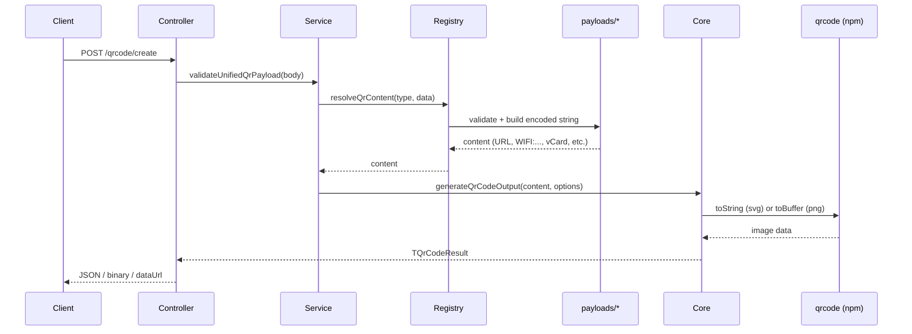

# cms-generate-qrcode — Engineering Documentation

HTTP microservice for generating QR codes in multiple formats and payload types. Built for CMS integration: callers send structured JSON, receive base64-encoded images (SVG or PNG), raw binary, or data URLs.

## Architecture

The service was refactored from a monolithic helper into a modular pipeline. Each QR type has its own payload validator and content builder; rendering and HTTP concerns are separated.

```
src/
  index.ts                          # Binds HTTP server to APP_PORT_HTTP
  app/http/
    index.ts                        # Express app: JSON parser, routes, error handler
    health.routes.ts                # GET /health
    qrcode/
      qrcode.routes.ts              # Route definitions
      qrcode.controller.ts          # Request handlers
      qrcode.response.ts            # JSON / binary / dataUrl response shaping
  libs/
    config/index.ts                 # APP_NAME, APP_VERSION, port, NODE_ENV
    exceptions/InvalidParameterException.ts
    middlewares/errorHandler.middleware.ts
    helpers/
      generateQrCode.ts             # Re-exports qrcode module (public import path)
      qrcode/
        core.ts                     # SVG/PNG rendering via npm `qrcode`
        registry.ts                 # Maps type → content resolver
        service.ts                  # Unified payload validation, API info
        batch.ts                    # Multi-URL batch generation
        types.ts                    # Shared TypeScript types and constants
        validators/                 # Options and common field validation
        payloads/                   # Per-type payload builders
          text.ts
          network.ts                # WiFi
          contact.ts                # vCard
          communication.ts          # WhatsApp, email, phone, SMS
          location.ts
          marketing.ts              # UTM, social, app store
          event.ts                  # Google Calendar
          form.ts                   # Google Forms (added post-refactor)
```

### Request flow



**Key design choices:**

- **Registry pattern** (`registry.ts`): adding a QR type means implementing validate + build functions in `payloads/`, then registering a resolver in `QR_CONTENT_RESOLVERS`.
- **Default format is SVG**; PNG is opt-in via `options.format`.
- **Default response mode is `json`**; preview endpoint defaults to `binary` for direct `` embedding.
- **Batch items are URL-only** and processed independently — one failure does not abort the rest.

## Setup

### Prerequisites

- Node.js (compatible with TypeScript 6 and Express 5)
- npm

### Install and run

```bash
npm install
npm run dev      # ts-node-dev with hot reload
npm run build    # tsc + tsc-alias → dist/
npm start        # node dist/index.js
```

### Environment variables

| Variable | Default | Description |
|----------|---------|-------------|
| `APP_PORT_HTTP` | `3050` | HTTP listen port |
| `NODE_ENV` | `development` | Environment label (returned by `/health`) |

Optional `.env` in project root:

```env
APP_PORT_HTTP=3050
NODE_ENV=development
```

On startup: `{APP_NAME} v{APP_VERSION} berjalan di http://localhost:{port}`.

### Quick smoke test

```bash
# Health check
curl -s http://localhost:3050/health | jq

# API discovery
curl -s http://localhost:3050/qrcode | jq

# Create a URL QR code (PNG, JSON response)
curl -s -X POST http://localhost:3050/qrcode/create \
  -H 'Content-Type: application/json' \
  -d '{"type":"url","data":{"url":"https://example.com"},"options":{"format":"png","width":400}}' | jq

# Preview as inline image (binary)
curl -s "http://localhost:3050/qrcode/preview?url=https://example.com&format=png&width=300" \
  --output preview.png
```

## HTTP API

### Discovery and health

| Method | Path | Description |
|--------|------|-------------|
| `GET` | `/health` | Service health (`status`, `version`, `environment`, `timestamp`) |
| `GET` | `/qrcode` | API metadata: supported types, endpoints, options, examples |

Use `GET /qrcode` as the live source of truth for endpoint lists and example payloads.

### Recommended: unified create endpoint

**`POST /qrcode/create`**

Single entry point for all QR types. Body shape:

```json
{
  "type": "url",
  "data": { "url": "https://example.com" },
  "options": {
    "format": "png",
    "width": 400,
    "responseMode": "json"
  }
}
```

| Field | Required | Description |
|-------|----------|-------------|
| `type` | yes | One of the supported types (see table below) |
| `data` | yes | Type-specific payload object |
| `options` | no | Rendering and response options |

For `type: "batch"`, `data` must contain an `items` array (see [Batch generation](#batch-generation)).

### Preview (URL QR as image)

**`GET /qrcode/preview`**

Generates a URL QR code from query parameters. Intended for direct embedding in HTML:

```html

```

| Query param | Required | Description |
|-------------|----------|-------------|
| `url` | yes | HTTP/HTTPS URL to encode |
| `format` | no | `svg` (default) or `png` |
| `width` | no | 100–2000 px |
| `margin` | no | 0–20 |
| `errorCorrectionLevel` | no | `L`, `M`, `Q`, or `H` |
| `darkColor` | no | Hex color, e.g. `#000000` |
| `lightColor` | no | Hex color, e.g. `#ffffff` |
| `responseMode` | no | Defaults to `binary` (not `json`) |

Binary responses include headers:

- `Content-Type`: `image/svg+xml` or `image/png`
- `Content-Disposition`: inline filename
- `X-QR-Content`: URL-encoded encoded content string
- `X-QR-Format`: `svg` or `png`

### Per-type legacy endpoints

These accept the type-specific `data` fields directly in the request body (not wrapped in `{ type, data }`), plus optional `options`:

| Method | Path | Type |
|--------|------|------|
| `POST` | `/qrcode/generate` | `url` |
| `POST` | `/qrcode/generate-text` | `text` |
| `POST` | `/qrcode/generate-wifi` | `wifi` |
| `POST` | `/qrcode/generate-vcard` | `vcard` |
| `POST` | `/qrcode/generate-whatsapp` | `whatsapp` |
| `POST` | `/qrcode/generate-email` | `email` |
| `POST` | `/qrcode/generate-location` | `location` |
| `POST` | `/qrcode/generate-phone` | `phone` |
| `POST` | `/qrcode/generate-sms` | `sms` |
| `POST` | `/qrcode/generate-utm` | `utm` |
| `POST` | `/qrcode/generate-event` | `event` |
| `POST` | `/qrcode/generate-social` | `social` |
| `POST` | `/qrcode/generate-app` | `app` |
| `POST` | `/qrcode/generate-form` | `form` |
| `POST` | `/qrcode/generate-batch` | URL batch (see below) |

Prefer `/qrcode/create` for new integrations.

## QR types and payloads

### `url`

```json
{ "url": "https://example.com/page" }
```

- URL must use `http:` or `https:` protocol.

### `text`

```json
{ "text": "Plain text content" }
```

- Max 2000 characters.

### `wifi`

```json
{
  "ssid": "MyNetwork",
  "password": "secret123",
  "encryption": "WPA",
  "hidden": false
}
```

| Field | Required | Constraints |
|-------|----------|-------------|
| `ssid` | yes | Non-empty string |
| `password` | conditional | Required when `encryption` is `WPA` or `WEP` |
| `encryption` | no | `WPA` (default), `WEP`, or `nopass` |
| `hidden` | no | Boolean, default `false` |

Encodes as `WIFI:T:...;S:...;P:...;H:...;;` per WiFi QR standard.

### `vcard`

```json
{
  "fullName": "Jane Doe",
  "organization": "Acme Inc",
  "phone": "+6281234567890",
  "email": "jane@example.com",
  "website": "https://example.com",
  "address": "123 Main St"
}
```

- `fullName` is required; other fields are optional.
- Output is vCard 3.0.

### `whatsapp`

```json
{ "phone": "6281234567890", "message": "Hello" }
```

- Phone: 8–15 digits (spaces, `+`, `-`, `()` stripped before validation).
- `message` optional, max 1000 characters.
- Encodes as `https://wa.me/{phone}?text=...`.

### `email`

```json
{
  "email": "user@example.com",
  "subject": "Inquiry",
  "body": "Message body"
}
```

- `email` required and validated.
- `subject` max 200 chars; `body` max 1000 chars.
- Encodes as `mailto:` URL.

### `phone`

```json
{ "phone": "6281234567890" }
```

- Encodes as `tel:+{phone}`.

### `sms`

```json
{ "phone": "6281234567890", "message": "Hi" }
```

- `message` optional, max 500 characters.
- Encodes as `sms:+{phone}?body=...`.

### `location`

```json
{
  "latitude": -6.2088,
  "longitude": 106.8456,
  "label": "Jakarta"
}
```

- `latitude`: -90 to 90; `longitude`: -180 to 180.
- `label` optional.
- Encodes as `geo:{lat},{lng}?q={label}`.

### `utm`

```json
{
  "url": "https://example.com/promo",
  "utm_source": "qrcode",
  "utm_medium": "print",
  "utm_campaign": "summer-sale",
  "utm_term": "optional",
  "utm_content": "optional"
}
```

- `url` required (HTTP/HTTPS).
- At least one UTM parameter required; each max 100 characters.
- UTM params are merged into the URL query string (existing query params preserved).

### `event`

```json
{
  "title": "Team Meeting",
  "startAt": "2026-06-15T09:00:00.000Z",
  "endAt": "2026-06-15T10:00:00.000Z",
  "description": "Weekly sync",
  "location": "Conference Room A"
}
```

- `title`, `startAt`, `endAt` required (ISO 8601 dates).
- `endAt` must be after `startAt`.
- Encodes as Google Calendar template URL.

### `social`

```json
{ "platform": "instagram", "username": "myhandle" }
```

| Platform | Username rules |
|----------|----------------|
| `instagram`, `tiktok`, `youtube`, `linkedin`, `facebook`, `twitter`, `telegram` | 1–50 chars: `[a-zA-Z0-9._-]` |
| `youtube` (channel ID) | `UC` prefix + 20+ word chars |

Leading `@` is stripped. YouTube handles both `@handle` and channel IDs starting with `UC`.

### `app`

```json
{ "platform": "ios", "appId": "1234567890" }
```

| Platform | `appId` format |
|----------|----------------|
| `ios` | Numeric App Store ID, 5–12 digits |
| `android` | Package name, e.g. `com.example.app` |

### `form`

```json
{ "formId": "1FAIpQLSf_example_form_id" }
```

- Google Form ID: 10–200 chars, `[a-zA-Z0-9_-]`.
- Encodes as `https://docs.google.com/forms/d/{formId}/viewform`.

## Rendering options

Passed as `options` in the request body (or query params for preview):

| Option | Default | Constraints |
|--------|---------|-------------|
| `format` | `svg` | `svg` or `png` |
| `width` | library default | Integer 100–2000 (px) |
| `margin` | library default | Integer 0–20 |
| `errorCorrectionLevel` | `M` | `L`, `M`, `Q`, or `H` |
| `darkColor` | `#000000` | Hex `#RGB` or `#RRGGBB` |
| `lightColor` | `#ffffff` | Hex `#RGB` or `#RRGGBB` |
| `responseMode` | `json` | `json`, `binary`, or `dataUrl` |

## Response modes

### `json` (default)

```json
{
  "success": true,
  "message": "QR code url berhasil dibuat",
  "format": "png",
  "mimeType": "image/png",
  "content": "https://example.com",
  "sizeBytes": 1234,
  "filename": "qrcode-url-1718342400000.png",
  "base64": "iVBORw0KGgo..."
}
```

`dataUrl` is included only when `responseMode` is `dataUrl`:

```json
{
  "dataUrl": "data:image/png;base64,iVBORw0KGgo..."
}
```

### `binary`

Raw image bytes with `Content-Type` set to the image MIME type. Use for direct file download or `` when combined with the preview endpoint.

### `dataUrl`

Same as `json`, but the response also includes a `dataUrl` field suitable for inline embedding without client-side base64 decoding.

## Batch generation

Generate multiple URL QR codes in one request. Max **50 items** per request (`BATCH_QR_MAX_ITEMS`).

### Via unified endpoint

```json
{
  "type": "batch",
  "data": {
    "items": [
      { "id": "page-1", "url": "https://example.com/a" },
      { "id": "page-2", "url": "https://example.com/b" }
    ]
  },
  "options": { "format": "png", "width": 300 }
}
```

### Via dedicated endpoint

**`POST /qrcode/generate-batch`**

```json
{
  "items": [
    { "id": "optional-id", "url": "https://example.com" }
  ],
  "options": { "format": "svg" }
}
```

### Batch response

```json
{
  "success": true,
  "message": "2 dari 2 QR code berhasil dibuat",
  "type": "batch",
  "total": 2,
  "successCount": 2,
  "failedCount": 0,
  "items": [
    {
      "id": "page-1",
      "url": "https://example.com/a",
      "success": true,
      "content": "https://example.com/a",
      "format": "png",
      "mimeType": "image/png",
      "base64": "...",
      "dataUrl": "data:image/png;base64,...",
      "sizeBytes": 1234,
      "filename": "qrcode-url-1718342400000.png"
    }
  ]
}
```

The `type` field is present when batch is created via `/qrcode/create`; the dedicated `/qrcode/generate-batch` endpoint omits it.

Failed items return `success: false` with a `message` explaining the error; other items still succeed.

**Constraint:** batch only supports URL QR codes, not other payload types.

## Error handling

Validation errors throw `InvalidParameterException` and return HTTP **400**:

```json
{
  "success": false,
  "message": "url wajib diisi dan berupa string"
}
```

Unexpected server errors return HTTP **500**:

```json
{
  "success": false,
  "message": "Terjadi kesalahan pada server"
}
```

Error messages are in Indonesian, matching the validation strings in source.

## Troubleshooting

### QR renders but scanner cannot read it

- Increase `width` (low resolution reduces scannability).
- Raise `errorCorrectionLevel` to `Q` or `H` if the QR will be printed or overlaid with a logo.
- Ensure sufficient `margin` (quiet zone); try `margin: 2` or higher.

### `width harus bilangan bulat antara 100 dan 2000`

`width` must be an integer, not a float or string. In query params for preview, pass a numeric value (`width=400`).

### URL validation fails for valid-looking URLs

Only `http:` and `https:` protocols are accepted. `ftp:`, `mailto:`, and custom schemes must use the dedicated type endpoints (`email`, `phone`, etc.) instead of the `url` type.

### WiFi QR connects but password is wrong

Special characters in SSID/password are escaped per the WiFi QR spec. Verify `encryption` matches the network (`WPA` vs `WEP` vs `nopass` for open networks).

### Batch partially fails

Each item is validated and generated independently. Check `failedCount` and per-item `message` in the response. Common causes: invalid URL in one item, or QR library failure for unusually long URLs.

### PNG vs SVG in clients

- **SVG** (default): smaller payload, scales cleanly; some older systems lack SVG support.
- **PNG**: universal image support; larger base64 payload. Set `format: "png"` explicitly when needed.

### Adding a new QR type

1. Create `src/libs/helpers/qrcode/payloads/{name}.ts` with `validate*Payload` and `build*` functions.
2. Export from `payloads/index.ts`.
3. Register in `registry.ts` → `QR_CONTENT_RESOLVERS`.
4. Add type to `TQrCodeType` and `QR_CODE_TYPES` in `types.ts`.
5. Add route + controller handler in `qrcode.routes.ts` / `qrcode.controller.ts`.
6. Update `getQrCodeApiInfo()` in `service.ts`.

## Operational notes

- **No authentication** is implemented; place the service behind a reverse proxy or API gateway in production.
- **No rate limiting** or request size limits beyond Express defaults; large batch requests (up to 50 items) generate images concurrently via `Promise.all`.
- **Health check** for load balancers: `GET /health` returns `200` with `status: "ok"`.
- **Version** is read from `package.json` at build/runtime.
